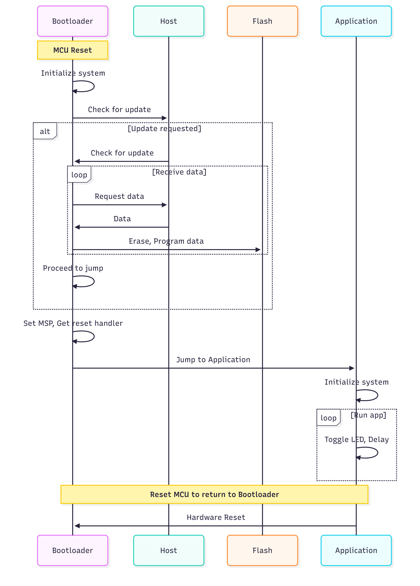

# STM32F1 UART Bootloader

A custom bootloader implementation for STM32F103C8T6 (Blue Pill) that enables firmware updates via UART communication. This project demonstrates a complete bootloader solution with a PC-side tool for uploading application firmware over serial communication.



## 🌟 Features

- **Custom UART Bootloader**: Allows firmware updates without external programming tools
- **Dual-Project Structure**: Separate bootloader and application projects
- **PC Upload Tool**: Cross-platform C application for uploading firmware binaries
- **Protocol-Based Communication**: Custom OTA (Over-The-Air) protocol for reliable firmware transfer
- **Version Management**: Built-in version tracking for both bootloader and application
- **Memory Protection**: Proper flash memory partitioning between bootloader and application
- **Block Transfer**: 1KB block size for efficient data transfer

## 🔧 Hardware Requirements

- **Microcontroller**: STM32F103C8T6 (Blue Pill) or compatible STM32F1 series
- **Flash Memory**: 64KB Flash, 20KB RAM
- **Communication**: UART interface (default: 115200 baud, 8N1)
- **Programmer**: ST-Link V2 or compatible (for initial bootloader flashing)
- **USB-to-Serial Adapter**: For firmware updates via UART

## 📐 Memory Layout

The flash memory is partitioned as follows:

| Memory Region | Start Address | Size | Description |
|--------------|---------------|------|-------------|
| **Bootloader** | 0x08000000 | 16KB | Bootloader code |
| **Reserved** | 0x08004000 | 1KB | Reserved space |
| **Application** | 0x08004400 | 47KB | Application firmware (48,128 bytes) |

- **Bootloader Region**: `0x08000000 - 0x08003FFF` (16KB)
- **Reserved Region**: `0x08004000 - 0x080043FF` (1KB - Reserved)
- **Application Region**: `0x08004400 - 0x0800FFFF` (47KB = 48,128 bytes)
- **RAM**: `0x20000000 - 0x20004FFF` (20KB) - Shared between bootloader and application

## 📁 Project Structure

```
STM32F1_BootLoader_UART/
├── Bootloader/              # Bootloader project
│   ├── Core/                # Main bootloader source code
│   │   ├── Inc/            # Header files
│   │   └── Src/            # Source files (main.c, etc.)
│   ├── Drivers/            # STM32 HAL drivers
│   ├── Bootloader.ioc      # STM32CubeMX configuration
│   └── STM32F103C8TX_FLASH.ld  # Linker script (16KB @ 0x08000000)
│
├── Application/             # Application project (LED blink demo)
│   ├── Core/                # Main application source code
│   │   ├── Inc/            # Header files
│   │   └── Src/            # Source files (main.c, etc.)
│   ├── Drivers/            # STM32 HAL drivers
│   ├── Application.ioc     # STM32CubeMX configuration
│   └── STM32F103C8TX_FLASH.ld  # Linker script (47KB @ 0x08004400)
│
├── PcTool/                  # PC-side firmware upload tool
│   ├── etx_ota_update_main.c   # Main upload application
│   ├── etx_ota_app.exe        # Compiled Windows executable
│   ├── RS232/                  # RS232 communication library
│   └── Readme.txt             # Tool usage instructions
│
├── Sequence_Bootloader.png  # Bootloader sequence diagram
└── README.md               # This file
```

## 🚀 Getting Started

### Prerequisites

- **STM32CubeIDE** or **STM32CubeMX** + **ARM GCC Toolchain**
- **ST-Link Utility** or **STM32CubeProgrammer** (for initial flashing)
- **GCC Compiler** (for building PC tool on Linux/Mac)
- **Serial Terminal** (optional, for debugging)

### Building the Projects

#### 1. Build the Bootloader

```bash
cd Bootloader/
# Open in STM32CubeIDE or build with:
# make
```

- The bootloader binary will be generated in `Bootloader/Debug/` directory
- Flash address: `0x08000000`

#### 2. Build the Application

```bash
cd Application/
# Open in STM32CubeIDE or build with:
# make
```

- The application binary will be generated in `Application/Debug/` directory
- Flash address: `0x08004400`

#### 3. Build the PC Tool (Linux/Mac)

```bash
cd PcTool/
gcc etx_ota_update_main.c RS232/rs232.c -IRS232 -Wall -Wextra -O2 -o etx_ota_app
```

For Windows, a pre-compiled `etx_ota_app.exe` is provided.

### Initial Programming

For the first time, you need to flash the bootloader using ST-Link:

1. Connect ST-Link to your STM32F103C8T6 board
2. Open STM32CubeProgrammer or ST-Link Utility
3. Flash `Bootloader/Debug/Bootloader.bin` to address `0x08000000`
4. Reset the board

## 💻 Usage

### Uploading Firmware via UART

Once the bootloader is installed, you can upload new application firmware over UART:

#### Step 1: Connect Hardware
- Connect USB-to-Serial adapter to your STM32 UART pins
- Identify the COM port (e.g., COM8 on Windows, /dev/ttyUSB0 on Linux)

#### Step 2: Run the Upload Tool

**Windows:**
```cmd
cd PcTool
etx_ota_app.exe <COM_PORT_NUMBER> <PATH_TO_BIN_FILE>

Example:
etx_ota_app.exe 8 ..\Application\Debug\Application.bin
```

**Linux/Mac:**
```bash
cd PcTool
./etx_ota_app <COM_PORT_NUMBER> <PATH_TO_BIN_FILE>

Example:
./etx_ota_app 0 ../Application/Debug/Application.bin
```

#### Step 3: Upload Process
1. The tool opens the specified COM port at 115200 baud
2. Sends firmware in 1KB blocks
3. Displays progress during upload
4. Verifies the transfer
5. Bootloader jumps to the new application

### Bootloader Operation

The bootloader performs the following sequence:

1. **Power On/Reset**: Bootloader starts at `0x08000000`
2. **UART Check**: Listens for upload commands via UART
3. **Firmware Reception**: Receives application binary in blocks
4. **Flash Programming**: Writes application to flash starting at `0x08004400`
5. **Verification**: Validates the uploaded firmware
6. **Jump to App**: Transfers control to the application at `0x08004400`

## 🔌 UART Protocol

The bootloader uses a custom protocol for firmware updates:

- **Baud Rate**: 115200
- **Data Format**: 8 data bits, No parity, 1 stop bit (8N1)
- **Block Size**: 1024 bytes (1KB)
- **Maximum Firmware Size**: 47KB (48,128 bytes available in flash)

### Communication Sequence

1. PC Tool sends firmware metadata (size, version)
2. Bootloader acknowledges and prepares for reception
3. PC Tool sends firmware in 1KB blocks
4. Bootloader programs each block to flash and sends ACK
5. After final block, bootloader verifies integrity
6. Bootloader jumps to application

## 🛠️ Customization

### Changing Memory Layout

Edit the linker scripts to adjust memory allocation:

- **Bootloader**: `Bootloader/STM32F103C8TX_FLASH.ld`
- **Application**: `Application/STM32F103C8TX_FLASH.ld`

**Important**: Update `ETX_APP_START_ADDRESS` in the bootloader code to match your application start address.

### Modifying UART Settings

Edit the UART configuration in:
- **Bootloader**: `Bootloader/Core/Src/main.c`
- **PC Tool**: `PcTool/etx_ota_update_main.c`

### Application Example

The included application is a simple LED blink program that:
- Blinks the onboard LED (PC13)
- Demonstrates basic application structure
- Shows version information (v0.1)

Replace this with your own application code while maintaining the memory layout.

## 🐛 Troubleshooting

| Issue | Solution |
|-------|----------|
| **Upload fails** | Check COM port number and connections |
| **No response from bootloader** | Verify bootloader is flashed correctly at 0x08000000 |
| **Application doesn't start** | Verify application flash address is 0x08004400 |
| **Serial port errors** | Ensure no other program is using the COM port |
| **File size too large** | Application must fit in 47KB (48,128 bytes) |

## 📝 Version Information

- **Bootloader Version**: v1.0
- **Application Version**: v0.1
- **Maximum Application Size**: 47KB (48,128 bytes)

## 📄 License

This project is based on STMicroelectronics HAL libraries and is provided as-is for educational and development purposes.

## 🙏 Credits

- **STM32 HAL Libraries**: STMicroelectronics
- **RS232 Library**: Teunis van Beelen
- **Project Author**: thien2411-vn

## 🔗 Resources

- [STM32F103C8T6 Datasheet](https://www.st.com/resource/en/datasheet/stm32f103c8.pdf)
- [STM32CubeIDE](https://www.st.com/en/development-tools/stm32cubeide.html)
- [STM32 HAL Documentation](https://www.st.com/resource/en/user_manual/dm00154093.pdf)

## 🤝 Contributing

Feel free to submit issues and enhancement requests!

---

**Note**: This bootloader is designed for the STM32F103C8T6 microcontroller. Adaptation for other STM32 devices may require modifications to memory layout and peripheral configurations.