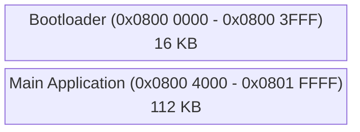
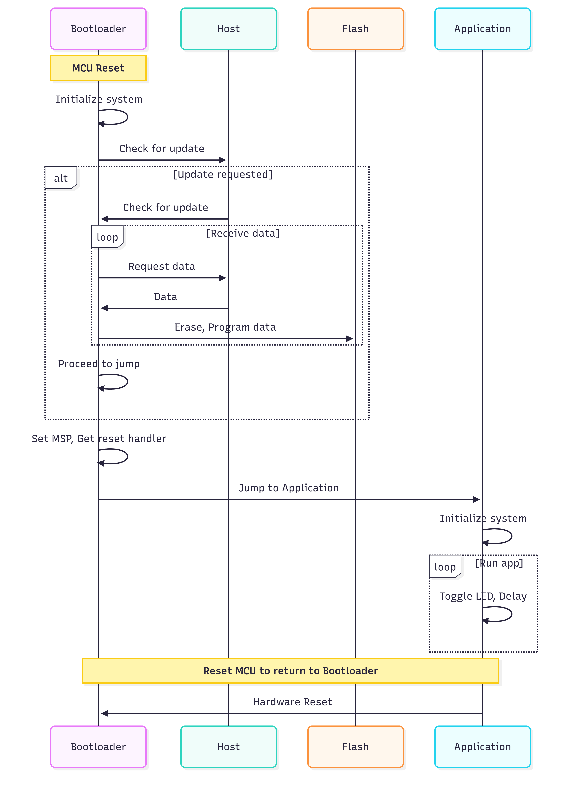
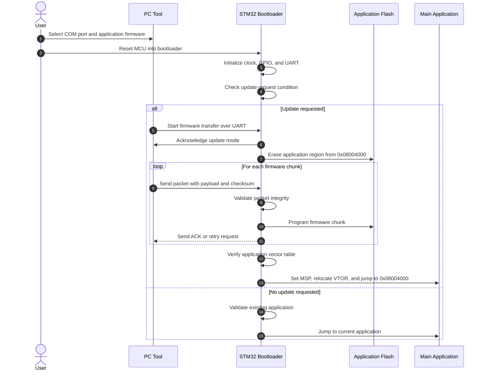

# STM32F1 Custom UART Bootloader

)

A lightweight, robust, and highly efficient custom Bootloader designed for STM32F1 microcontrollers, using UART for firmware updates. This project demonstrates deep understanding of ARM Cortex-M architecture, memory management, and bare-metal programming.

## Features
- **Bare-metal C Implementation**: Minimal memory footprint, optimized for STM32F103 series.
- **Reliable UART Protocol**: Custom packet structure with verification to ensure firmware integrity during serial updates.
- **Application Branching**: Safely vectorizes and jumps from the Bootloader memory space to the Main Application space.
- **Custom PC Tool**: Includes a host application to parse `.bin`/`.hex` files and transmit them over serial.

## Memory Map Architecture

Understanding the flash memory layout is critical for this bootloader. The STM32F103 flash is divided into two main sections:

```mermaid
block-beta
  columns 1
  Bootloader["Bootloader (0x0800 0000 - 0x0800 3FFF)\n16 KB"]
  Application["Main Application (0x0800 4000 - 0x0801 FFFF)\n112 KB"]
```

1. **Bootloader Region**: Starts at `0x08000000`. This is the first code executed upon reset. It initializes hardware, checks for firmware update requests, and either jumps to the application or enters update mode.
2. **Application Region**: Starts at `0x08004000`. The interrupt vector table must be relocated here.

## Bootloader Update Sequence

```mermaid
sequenceDiagram
    autonumber
    actor User
    participant PCTool as PC Tool
    participant Bootloader as STM32 Bootloader
    participant Flash as Application Flash
    participant App as Main Application

    User->>PCTool: Select COM port and application firmware
    User->>Bootloader: Reset MCU into bootloader
    Bootloader->>Bootloader: Initialize clock, GPIO, and UART
    Bootloader->>Bootloader: Check update request condition

    alt Update requested
        PCTool->>Bootloader: Start firmware transfer over UART
        Bootloader->>PCTool: Acknowledge update mode
        Bootloader->>Flash: Erase application region from 0x08004000
        loop For each firmware chunk
            PCTool->>Bootloader: Send packet with payload and checksum
            Bootloader->>Bootloader: Validate packet integrity
            Bootloader->>Flash: Program firmware chunk
            Bootloader-->>PCTool: Send ACK or retry request
        end
        Bootloader->>Bootloader: Verify application vector table
        Bootloader->>App: Set MSP, relocate VTOR, and jump to 0x08004000
    else No update requested
        Bootloader->>Bootloader: Validate existing application
        Bootloader->>App: Jump to current application
    end
```

## System Workflow
1. **Reset**: MCU boots into the Bootloader.
2. **Check Status**: Bootloader checks a specific memory address or a GPIO pin state to determine if an update is requested.
3. **Firmware Update (if requested)**:
   - Erases the Application flash region.
   - Receives new firmware chunks via UART.
   - Writes to flash and verifies integrity.
4. **Jump to App**: Relocates the Vector Table offset (`SCB->VTOR`) and updates the Main Stack Pointer (MSP) before branching to `0x08004000`.

## Setup & Usage

### 1. Compile the Firmware
- Import the `Bootloader` project into **STM32CubeIDE**.
- Build to generate the `Bootloader.bin`.
- Do the same for the `Application` project, ensuring the linker script (`.ld`) is modified to start at `0x08004000`.

### 2. Flashing
- Flash the `Bootloader.bin` to the MCU at `0x08000000` using ST-Link.
- Run the PC Tool provided in the `PcTool/` directory, select your COM port, and upload `Application.bin`.

## Repository Structure
- `/Bootloader`: The bootloader firmware source code.
- `/Application`: A sample user application demonstrating the relocated vector table.
- `/PcTool`: Host script/software for transmitting the binary payload.

---
*Created to demonstrate embedded systems expertise, low-level microcontroller initialization, and communication protocols.*
